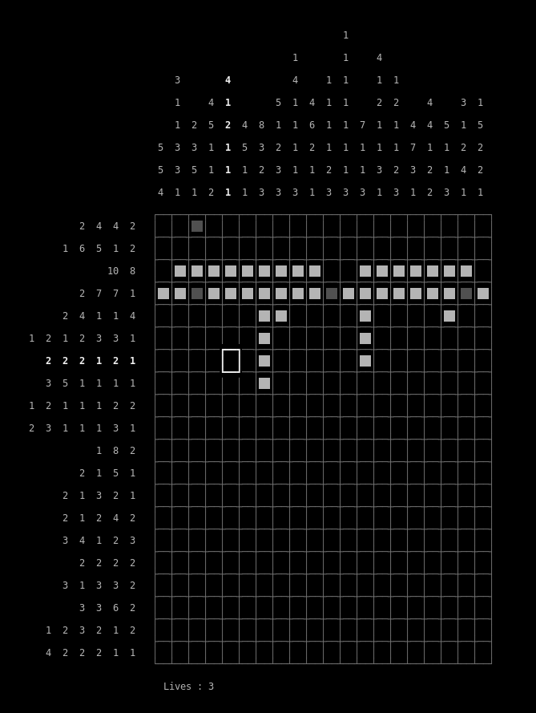

# nonogram-rs

> Nonogram game implementation in Rust



## Run

```sh
git clone git@github.com:quentm74/nonogram-rs.git
cargo run
```

## Shortcuts

| shortcut | action       |
|----------|--------------|
| *q*      | quit         |
| *r*      | new game     |
| *f*      | active cell  |
| *v*      | disable cell |
